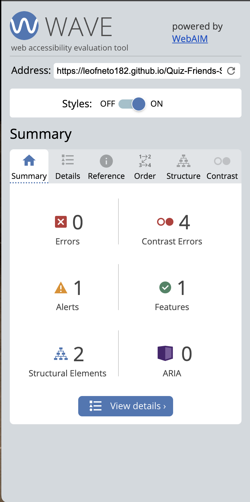

# Friends Quiz

Friends Quiz is a quick and straightforward quiz of 15 questions based on the famous american TV show from 1994 tha has entertained generations of comedy fans, including myselsf.

## Existing Features

- ### The Main Screen

    * The main screen consists in a single Start button right in the middle of the screen, which atracts the user curiosity.

    

- ### Rules Screen

    * Right after clicking on the Start Quiz button, the user will get to know the 5 rules of the quiz, before starting. The user has the option of clicking on "Continue" button to start the Quiz or clicking on "Exit Quiz", to return to the main screen.

    

- ### Quiz Start

    * Starting the quiz, the user will face a simple and intuitive quiz box and 15 questions to answer with 4 answers option each. The quiz box has a timer on top-right of the box, a live time-line. All the four options have a hover effect in order to grab the user attention as well as a question counter on the bottom-left of the screen.

    

    * If in any instance the timer goes off, the right answer option will be revealed with a light green background and a "tick" icon at the end, however, the user will not get any point for that.

    

    * Wheter the user selects a wrong answer, the selected option will get a light red background color with a cross icon at the end, as well as the right answer will be revealed.

    

- ### Quiz Result

    * No matter the amount of the questions the user gets, the first message of the result box will be that the user completed the quiz with a beating claping hands icon on top of the box and two options: Replay Quiz or Quit Quiz.
    * Depending on the user performance, the result will give them a different result message, right after the standard message.

    * Less than 7 correct answers: 

    

    * 8 or more correct answers: 

    

    * 12 or more correct answers:

    

## Features left to implement

* Creating a shuffle function in JavaScript in order to get all the questions shuffled;

* Incresing the design by adding more features to the "Start Button" screen, for exemple: the name of the quiz as header and a few sorted images;

* Adding a related image for every question, which can help the user to remember the subject of the question;

* Creating a Difficulty selector;

* Creating a High Scores section.

# Design

* The design was created to be simple and intuitive to make the user replay the quiz as many times they want and fast, in order to get the 15 questions right.

* The colours palette is based on the Monica's apartment door, famous for the contrast and the distinct purple colour: 

* The quiz page contains a Favicon with a purple background inspired of the scene when Monica has a giant turkey in her head: 

# Testing

*  The website was built to be responsive on screens 320px wide and above.

* All the buttons, features are working as expected.

## Validator Testing

- ### HTML

    * No errors were returned when passing through the official [W3C Validator](https://validator.w3.org/).

    

- ### CSS

    * No errors were found when passing through the official [(Jigsaw) validator](https://jigsaw.w3.org/css-validator/).

    

- ### Lighthouse

    

- ### Wave

    

# Deployment 

* The site was deployed to GitHub pages. The steps to deploy are as follows:

    - In the GitHub repository, navigate to the Settings tab;
    - From the source section drop-down menu, select the Master Branch
    - Once the master branch has been selected, the page will be automatically refreshed with a detailed ribbon display to indicate the successful deployment.

* The link can be found here: https://leofneto182.github.io/Quiz-Friends-Show-PP2/

# Credits

- ## Questions Content
    
    - All the questions and answers content was taken from: [beano.com](https://www.beano.com/posts/the-ultimate-friends-trivia-quiz)

- ## Media

    - Favicon image got from [redbubble.com](https://www.redbubble.com/i/sticker/Monica-Turkey-Head-Thanksgiving-by-izzydoodlesshop/40966541.EJUG5)

    - Monica's apartment door palette coulours taken from: [pinterest.ie](https://www.pinterest.ie/pin/AcT43PGI45QLha7r3RprCkTlsyW9YZvPy30TJMGE3gdVe8gUhwtWvfY/)

- ## Code

    -  Javascript code ideias taken from the follow youtubers: [WebDevSimplified](https://www.youtube.com/@WebDevSimplified), [Programming with Mosh](https://www.youtube.com/c/programmingwithmosh), [CodeWithHarry](https://www.youtube.com/channel/UCeVMnSShP_Iviwkknt83cww)
    